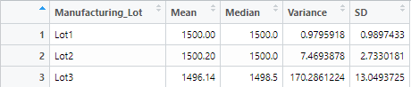

# MechaCar Statistical Analysis Challenge
## Overview
Our team has been tasked with completing a statistical analysis on the newest prototype, MechaCar, using our knowledge of R. Upper management at AutosRUs have encountered set backs concerning their newest prototype and would like us to review the production data. To assist, we have preformed a multiple linear regression to identify what factors can predict the mpg, collected summary statistics on the PSI of the suspension coils, ran analytical tests to determine if the manufacturing lots are statistically different from the mean population and designed an alternate study that coulld help improve the analysis.

## Linear Regression to Predict MPG

In this part of the analysis, we ran a multiple linear regression on the variables provided against the MPG to determine if these variables will assist in predicting future prototypes' MPG. We determined from the individual p-values (Pr(>|t|)) that ground clearance and vehicle length ave a non-random influence on the MPG values. These variables should be assessed to predict the MPG values of future prototypes. We can also determine that while the slope (identified as coefficients in R) appear to be small, they cannot be considered zero. A zero coefficient would signify a straight line and we can determine from our linear regression and graphing these lines, that there is a significant slope, espcially with regards to vehicle length and ground clearance. To summarize this aspect of the analysis, there is reason to believe that this model could predict the mpgs of future prototypes. We can make this determination by looking at the overall and individual p-values, which are less than the standard threshold of .05. The rsquared value of .71 also backs up the predictability of this model.

## Summary Statistics on Suspension Coils

In this portion of the analysis, we looked at the summary statistics regarding the PSI of suspension coils. Looking at the entirity of the data, we saw that variance was a bit high at 62.3 but within our threshold of a variance of 100. However, we wanted to see if this was the case over all three manufacturing lots or if this variance was skewed in any way. Looking at the summary statistics broken down by manufacturing lots, we could conclude that both Lot1 and Lot2 had small amounts of variance at 0.98 ad 7.47 respectively. However, we could see that Lot3 was producing suspension coils outside of the threshold at a variance of 170.29 and a standard deviation of 13.05. It would be advantageous to compare the manufacturing practices and material sources between the lots to determine the source of this variance so it can be corrected.

## T-Tests on Suspension Coils
In this analysis, we did a t-test on the data set as a whole and then ran the same test on each manufacturing lot. The point of this analysis is to do a deep dive on the variance we discovered in our previous analysis

### Results Across all Manufacturing Lots

The T-Test we performed on the whole dataset had a p-value of 0.06 which is close to the standard .05 threshold that determines that the variance is not random. This is alarming, but from our previous findings we can summize that the skew of Lot3's variance is driving our p-value down. To confirm this, we ran a t-test on each manufacturing lot

### Lot1 T-Test

In this t-test, we can see that Lot1 produces suspension coils with a PSI that is statistically identical to the population mean. We can conclude this based on the p-value of 1.0

### Lot2 T-Test

When running the t-test on Lot2, the p-value is .61 which is well within our statistical threshold. The mean is slightly different than the population's mean but it is not considered an anomolly

### Lot3 T-Test

As we suspected, Lot3 drove the total p-value down with their standalone p-value of .042. This suggests that the variance cannot be blamed on random chance and there is something that is causing a drastic difference between the PSI values at this plant and the values of the population's

